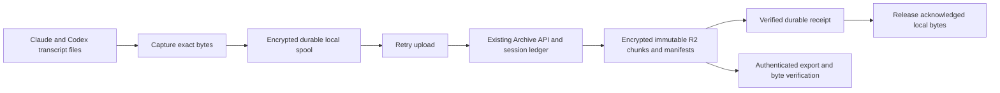

# Conversation Archive production plan

Review date: 2026-09-21. Reviewed commit: `4dbb153ba23fbec127de0ec6bf0ef5447927c616`, matching fetched `origin/main`.

Status: implemented and verified locally and in Cloud-Dev, authorized after the review. The findings below describe the reviewed base commit. Byte capture, retained generations, verified receipts, separate capture/upload scheduling, authenticated export, and permanent retention are implemented. Cloud-Dev capture and R2 restore passed for both sources, including empty truncation generations. The final Rust workspace passed 723 tests with one ignored; all 68 repository CI tasks passed. Production deployment, independent key-backup recovery, the 24-hour workload, and the production installation walkthrough remain release gates. See [release and recovery evidence](archive-recovery-runbook.md).

## Recommendation

Keep the existing Archive API, encrypted R2 objects, per-session commit ledger, and enrollment boundary. Make the encrypted local spool the authoritative record of what the collector captured. Upload must operate entirely from that spool, independent of whether the original transcript still exists or still has the same contents.

The permanent archive should preserve source bytes before interpreting them. Parsing and analytics can fail or change without losing those bytes. Extend the existing archive contract where necessary; do not introduce another ingest service, queue, or competing transcript store.

The guarantee starts when bytes have been durably written to the local spool. After that point, source deletion, rewriting, collector restart, and interrupted upload must not lose them. R2 durability starts at the verified server acknowledgement. Neither stage can recover bytes deleted before the collector read them. Watchers reduce that exposure; they do not eliminate it.

## Confirmed findings

All source references below refer to the reviewed commit. Paths are relative to the repository root.

| Finding                                                     | Concrete failure                                                                                                                                                                                                    | Evidence                                                                                                                                                                                | Required correction                                                                                                                                                        |
| ----------------------------------------------------------- | ------------------------------------------------------------------------------------------------------------------------------------------------------------------------------------------------------------------- | --------------------------------------------------------------------------------------------------------------------------------------------------------------------------------------- | -------------------------------------------------------------------------------------------------------------------------------------------------------------------------- |
| Blocking data loss: rewrite removes pending history         | Capture A while offline, rewrite the source to B, then sync. The collector deletes A's unacknowledged slices.                                                                                                       | `packages/collector-archive-sync/src/capture.rs:129`, `generation.rs:125`, `spool.rs:473`. The test at `tests/archive_sync.rs:1777` explicitly expects the deletion.                    | Preserve and upload both generations. Only a verified receipt or authorized terminal consent cleanup may retire captured bytes.                                            |
| Blocking omission: equal-length rewrite                     | An acknowledged file changes content without changing its complete byte extent. Discovery skips it before prefix validation.                                                                                        | `packages/collector-embedder/src/archive_history/mod.rs:246`.                                                                                                                           | Verify content before declaring a generation unchanged. Size and mtime are scheduling hints, not proof.                                                                    |
| Blocking retry stall: deleted source under new-only consent | An eligible conversation is spooled, upload fails, and the agent deletes its file. The next scan no longer includes it in `live_sessions`, so its pending upload is excluded.                                       | `packages/collector-archive-sync/src/history/plan.rs:173`, `history/work.rs:43`, `spool.rs:396`.                                                                                        | Persist eligibility under the enrollment generation at capture time. Recheck current enrollment authority on upload, not source existence.                                 |
| Capture waits on the network                                | Discovery stores a deferred path. The cycle captures and uploads one part before opening the next. Later files can disappear during those network waits.                                                            | `packages/collector-embedder/src/archive_history/mod.rs:291`, `packages/collector-archive-sync/src/cycle.rs:138`, `cycle.rs:203`. The request timeout is 120 seconds in `client.rs:38`. | Separate local capture scheduling from network retry. Capture must continue while uploads are slow or offline.                                                             |
| Some observed bytes never enter durable storage             | Oversized individual records produce a metadata-only blocked marker. Invalid complete JSONL records abort scanning; incomplete EOF tails are omitted from the upload. Deleting the original then loses those bytes. | `packages/collector-archive-sync/src/capture.rs:101`, `bound.rs:105`; `packages/collector-archive/src/jsonl_prefix.rs:7`, `jsonl_prefix.rs:81`.                                         | Preserve exact byte ranges independently of JSON validity and record size. Represent incomplete or malformed content honestly; do not count it as a valid complete record. |
| Configured source homes are missed                          | Source discovery hardcodes `~/.claude` and `~/.codex`. An agent using another config home can write outside every scanned root.                                                                                     | `packages/collector-embedder/src/sources.rs:52`. Both vendors document alternate homes, linked below.                                                                                   | Persist an explicit source-root list; support configured homes and multiple roots without reading credential files.                                                        |
| Public restore is unfinished                                | Every export grant is rejected, and the export handler only returns that rejection.                                                                                                                                 | `apps/archive-api/src/export-grant.ts:37`, `handler.ts:476`.                                                                                                                            | Implement the existing export contract and prove recovery without the source files or local spool. This needs a new working export consumer.                               |

The five-minute desktop interval at `apps/desktop/src-tauri/src/engine.rs:41` is also a capture limitation. A conversation created and deleted between scans may never be discovered. A missing file must never be interpreted as a request to delete its archive.

These findings do not imply that every pending upload is lost. Ordinary pending slices already contain their upload bytes, and normal all-history retry can operate without the source. The failures above are specific paths that bypass that protection.

## Existing protections to retain

- R2 uses conditional immutable writes and reads the stored bytes back before accepting an object: `apps/archive-api/src/archive-r2.ts:117`.
- The session ledger persists a commit intent, reserves storage, verifies object writes, commits ledger state, and only then returns the acknowledgement: `apps/archive-api/src/archive-ledger-commit.ts:408`.
- A committed request can replay its original acknowledgement: `apps/archive-api/src/archive-ledger-commit.ts:160`.
- Request and alarm recovery share the session's serialized execution path: `apps/archive-api/src/archive-ledger.ts:174`, `archive-ledger.ts:221`.
- Local acknowledgement processing stages progress before removing pending bytes: `packages/collector-archive-sync/src/spool.rs:678`.
- Source-native payloads are hashed from their original bytes: `packages/collector-archive/src/jsonl.rs:147`.
- Codex active and archived directories are both discovered, and Claude subagent parts have explicit identity handling: `packages/collector-embedder/src/sources.rs:55`, `packages/collector-archive-sync/src/scan.rs:42`.

Cloudflare documents strong read-after-write consistency for R2, including access through Worker bindings. That supports the existing write/read-back gate. It does not make several R2 objects plus ledger state one transaction; the persisted intent remains necessary. [R2 consistency](https://developers.cloudflare.com/r2/reference/consistency/).

## Contract to implement

### Capture and identity

Maintain separate captured and remotely acknowledged positions for each transcript part and generation. A source append adds bytes to the current generation. A rewrite or truncation starts a new generation with a durable predecessor relationship. Every captured prior generation remains uploadable. A rename or move of the same content does not create a new conversation.

Persist the source type, session/part identity, enrollment generation, eligibility evidence, byte range, payload hash, and generation relationship alongside encrypted bytes. For already identified eligible conversations, malformed records and incomplete tails must remain preservable without a successful analytics parse. Do not upload an unidentified session under new-only consent unless its eligibility can be established.

Deduplication identifies identical observations, not merely matching session IDs, file sizes, or record counts. Divergent copies are retained as separate observed versions with their provenance; they must not be resolved by silently picking the longest file.

Use one local spool owner. Watcher events, startup/resume, manual sync, and periodic reconciliation all feed that owner. Network work receives immutable spool entries and returns receipts; it cannot rewrite capture history. Watch events are hints to read the source, not a complete journal of source activity.

### Spool and upload

Capture writes encrypted bytes durably before advancing its captured position. File and directory durability failures must report failure, not successful capture. Restart reconstructs pending work from durable state.

Upload uses only persisted bytes. An unchanged retry uses the same content identity. A new generation never cancels an older pending generation. The server receipt should bind the exact request digest, transcript generation, acknowledged position, and committed manifest. The client must validate and durably persist that receipt before releasing local data. Current count-based receipt matching is in `packages/collector-archive-sync/src/ack.rs:37`; extending it is protocol hardening, not a claim that a wrong server response was observed.

Transport errors, timeouts, 429s, and retryable server failures retain entries and use bounded backoff with jitter. One blocked session cannot stop capture or upload of unrelated sessions. Expired authentication pauses upload and requests reauthentication; explicit revocation follows the established consent cleanup contract. An ambiguous failure is never evidence of revocation or permission to purge.

Retain the current no-eviction behavior at the local spool cap. Report disk exhaustion, spool capacity, and remote capacity as blocked capture or upload. Do not silently raise the 2 GiB local cap or the 100 GB organization cap. Drain acknowledged data to recover space; never evict pending data to look healthy. No finite disk can guarantee unlimited offline capture.

### Byte preservation and R2

Extend the existing versioned archive representation to support bounded byte segments within a transcript generation. Segment boundaries must not depend on JSON record boundaries. This preserves oversized records, partial tails, whitespace, and malformed bytes with one storage mechanism. Keep source-record interpretations and complete-record checkpoints as metadata derived from retained bytes.

The existing contract cannot represent all of this today. Implementation must update the Rust contract, TypeScript validation, packing, manifest verification, and export together. New manifests describe byte offsets, ordered segment hashes, and completeness. Existing archive versions remain readable; never relabel or rewrite old objects to claim bytes that were not stored.

Keep the existing Archive API boundary, tenant encryption, budget reservation, persisted commit intent, immutable objects, and verified acknowledgement sequence. R2 chunks and manifests remain the permanent store. Session lookup indexes must be reconstructible from archive manifests and key custody backups.

### Deletion and retention

Source deletion records that the source disappeared. It never deletes captured data, expires a retry, or closes a conversation permanently. If the file returns, reconcile its bytes against the last captured generation.

Archive deletion is a separate authenticated action. Preserve existing tenant ownership, enrollment consent, revocation, and organization-deletion boundaries. A local agent cannot authorize server archive deletion by removing a file.

The existing ADR promises paid retention and cryptographic erasure after a 90-day Pro grace period: `docs/adr/0012-agent-conversation-analytics.md:440`. Current lifecycle code records a frozen state and grace deadline: `packages/convex/archiveLib.ts:657`. The reviewed code does not wire grace expiry to erasure; organization deletion does invoke key destruction before object deletion at `packages/convex/admin/admin.ts:353`. The documented contract is still not unconditional permanent retention. My recommendation for this request is to retain acknowledged archives until explicit authorized deletion; subscription loss can stop new uploads. The approved implementation retains committed archive data until explicit deletion. It changes no billing or production resources during local implementation.

## Implementation order

Each slice has one reviewable outcome. Implementation and release owners below describe responsibilities, not already-assigned tickets.

| Order | Scope and owner                                                   | Files or existing components                                                                           | Done                                                                                                                                                                                                                                                                            |
| ----- | ----------------------------------------------------------------- | ------------------------------------------------------------------------------------------------------ | ------------------------------------------------------------------------------------------------------------------------------------------------------------------------------------------------------------------------------------------------------------------------------- |
| 1     | Collector implementer: stop known loss and retry stalls           | `capture.rs`, `generation.rs`, `spool.rs`, `history/plan.rs`, embedder `archive_history/`              | Offline capture followed by rewrite or deletion uploads every captured old and new version. Equal-length edits are discovered. Replace the test that expects pending history to be discarded.                                                                                   |
| 2     | Archive implementer: byte-segment contract and durable receipts   | `collector-archive`, `collector-archive-sync`, Archive API contract, validation, packing and manifests | Partial, malformed, and oversized records survive as exact bytes. The old format remains readable. A receipt for another digest or generation cannot remove a pending entry. Existing small-record and retry behavior remains compatible.                                       |
| 3     | Desktop implementer: prompt local capture with independent upload | Shared embedder source roots and sync scheduling, desktop `engine.rs`                                  | Configured roots are covered. File events trigger local capture while network requests are stalled. Startup/resume and full reconciliation recover missed events. Backfill progresses without starving active conversations.                                                    |
| 4     | Archive implementer: working restore                              | Existing export route/grant contract, manifest readers, Rust verification library, an export client    | An authorized user exports every selected session and generation. Export verifies decrypted bytes and identifies any missing/corrupt segment. Resume is bound to the same immutable manifest. No source machine or collector key is needed to recover server-acknowledged data. |
| 5     | Release owner: retention, recovery, health, and deployment proof  | Archive policy, existing status projections, coverage tool, runbook and smoke test                     | Retention policy is explicit; live bucket expiration rules are verified; wrapped keys and wrapping-secret recovery are tested; capture/ACK gaps are observable; the end-to-end matrix below passes at the release SHA.                                                          |

Slice 1 is the immediate repair. Slices 2 and 4 must share a frozen format specification and golden fixtures before implementation. Land server support before switching collectors to the new format. Do not make the new collector depend on an unshipped reader.

For filesystem events, use the maintained `notify` library rather than hand-written platform watchers. Retain periodic reconciliation because its documentation explicitly describes missed events and platform differences. [notify documentation](https://docs.rs/notify/latest/notify/).

Changing capture scheduling deliberately supersedes the ADR's five-minute, no-second-task rule at `docs/adr/0012-agent-conversation-analytics.md:597`. Update that rule in the implementation. There should still be one capture owner, not concurrent scans of the same source.

### Safe transition

Before any spool migration, stop its writer and preserve a recoverable encrypted copy plus the applicable key reference. Import existing pending requests without changing their bytes or identity. Keep old generations pending until acknowledged. Preserve consent provenance; an old new-only entry with insufficient eligibility evidence remains visible and retained rather than being silently uploaded or deleted.

Use versioned spool metadata and a restartable migration. An older binary must fail closed on an unsupported version instead of cleaning it up. Rollback must preserve newly captured data and keep a compatible reader available. No archive reimport, Tinybird migration, or production R2 rewrite is required for the immediate repair.

## Verification and release evidence

Run a synthetic source writer through the real collector and Archive API. Its independent expected-byte journal is the comparison oracle. After capture, remove the synthetic source files and local spool, then restore solely from R2 through the authenticated export path. Never delete a user's actual transcripts for a test.

| Scenario                                                                                                                        | Required evidence                                                                                                                     |
| ------------------------------------------------------------------------------------------------------------------------------- | ------------------------------------------------------------------------------------------------------------------------------------- |
| Claude parent/subagents; Codex parent/forks and active-to-archived moves                                                        | Correct identities and relationships, no missing parts, identical copies deduplicated without losing divergent copies.                |
| Offline append, rewrite, truncation, repeated rewrite, same-size edit, deletion, recreation                                     | Every durably captured generation restores byte-for-byte, including pending history from before the rewrite.                          |
| Both history-consent modes; deletion after capture but before ACK                                                               | Eligible pending data drains without the original source. Pre-enrollment and ambiguous new-only sessions remain excluded.             |
| Partial UTF-8 and JSON writes, missing newline, malformed middle line, unknown record type, record over current upload limit    | Exact source bytes are retained; incomplete/invalid content is labelled and never silently skipped.                                   |
| Crash after spool fsync, before/after R2 write, after ledger commit, before client receives ACK, during local receipt promotion | Restart converges to one committed copy per content identity and no lost pending bytes.                                               |
| HTTP timeouts, 429/5xx, unavailable Convex, expired credential, explicit revocation, corrupt spool entry                        | Correct retry or consent behavior; unrelated sessions continue; no false success.                                                     |
| Disk full, spool full, organization storage full                                                                                | No pending eviction or false watermark advancement; a visible blocked state; recovery after capacity returns.                         |
| Large history backlog with active conversations and slow network                                                                | Capture continues, memory stays bounded, progress is fair, and repeated scans do not hash/reparse the entire backlog in a tight loop. |
| Reordered/duplicate delivery, two collectors, key rotation during retry                                                         | Idempotent server state, exact receipt validation, recoverable old and new key versions.                                              |
| Missing/corrupt R2 object, unavailable key, export interruption                                                                 | Restore fails visibly with the affected part; resumes against the same manifest; never reports a complete archive with a gap.         |
| Source workstation lost; ledger/index restored or rebuilt                                                                       | R2 objects, manifests, and recovered key custody suffice for a verified export.                                                       |

Preserve independent coverage counters: eligible sources discovered, bytes locally captured, bytes server-acknowledged, pending bytes and oldest pending age, source-unavailable gaps, and last successful reconciliation. A recent ACK from one session does not prove coverage of all sessions. Extend the existing coverage tool, which currently compares source files with local progress rather than retrieving R2: `packages/collector-archive-sync/examples/archive_coverage.rs:19`.

Proposed release targets, to measure under the declared supported workload: p99 local capture within 5 seconds while awake and enrolled; p99 R2 acknowledgement within 60 seconds with healthy services and available capacity; zero lost locally committed bytes across the fault matrix. Report backlog/offline intervals separately. A 24-hour unattended run must include sleep/resume, network loss, deletion, and rewrites. These are acceptance targets, not measurements from this review.

The existing cloud smoke verifies uploads, retry acknowledgements, status, and authorization, but is Cloud-Dev-only and does not perform the full source-deletion/restore proof: `scripts/dev/archive-api-smoke.ts:375`. Extend that smoke through the actual collector and exporter. Perform the production walkthrough through normal installation, login, enrollment, capture, and export after explicit production approval. Record the desktop version, Worker release, commit SHA, fixture hashes, and verification result together.

Verify the live R2 bucket has no expiration rule that can remove retained archive objects. Preserve and test recovery of wrapped organization keys and their wrapping secret separately from object durability. R2's documented storage durability is not a backup of application key custody. [Object lifecycles](https://developers.cloudflare.com/r2/buckets/object-lifecycles/), [R2 durability](https://developers.cloudflare.com/r2/reference/durability/).

## Done

The archive is production-ready when all five implementation outcomes and the fault matrix pass, every eligible fixture's durably captured bytes can be restored after source deletion, the retention contract is explicit, and the normal-user production walkthrough has evidence tied to the deployed release.

Until then, report separate states for locally captured, remotely archived, and blocked/incomplete. Do not use a green analytics dashboard or successful HTTP upload as the archive-completeness signal.

## Checks executed during this review

- Fetched `origin/main` and confirmed it matches the reviewed SHA.
- `bun run --filter @trace-flow/archive-api test`: 37 test files, 264 tests passed. These are local Workers-runtime tests, not live production evidence.
- `cargo test -p collector-archive-sync changed_prefix_drops_unacknowledged_slices_before_forking_from_progress -- --exact --nocapture`: passed. This confirms the current test expects pending data to be dropped.
- `cargo test -p collector-archive-sync new_only_pending_requires_current_positive_session_proof -- --nocapture`: passed. This confirms the source-presence dependency.
- Verified current R2 conditional-write types and official R2 consistency documentation.
- The independent restore review passed 26 archive resource/deployment tests and 19 archive crypto tests. Its additional 48 Archive API tests overlap the full suite above and are not an additional coverage total.
- Read-only production probes returned HTTP 200 from health and HTTP 401 from unauthenticated export. They establish route availability, not the deployed SHA, working export, or archive completeness.
- No deploy, hosted smoke, production mutation, real-transcript export, or key-recovery drill was performed.

Vendor source-location references: [Claude configuration and session-history location](https://code.claude.com/docs/en/settings), [Codex state location](https://developers.openai.com/codex/config-advanced/). Source discovery should honor those locations without treating agent credentials or configuration files as transcript content.
