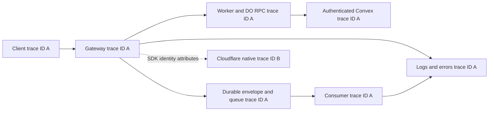

# Trace correlation audit and implementation

Date: 2026-10-04. Source baseline: `e3643a9f19da87fe8cb03fb6f8c89f16c9ce68ba`.
Local implementation: `codex/trace-correlation-audit`, uncommitted working tree.

## Outcome and policy

Valid incoming trace IDs continue through application processing, structured logs,
Sentry errors, authenticated Convex requests, queue delivery, and instrumented
Worker/Durable Object RPC. This implements the user's clarified goal to combine
identity. The earlier recommendation to separate customer and internal traces
and the blanket prohibition on Convex headers are superseded.

Keep Sentry SDK 10.73.0. A v11 migration is deferred because it changes configuration,
privacy defaults and instrumentation ownership without solving native ID equality.
Official documentation and practitioner reports are linked in
[research](trace-correlation-research.md).

Cloudflare native spans still have platform-owned IDs. Native child spans record
`sentry.trace_id` and `sentry.span_id` after SDK context establishment, allowing
search by application identity. This maps the two pipelines; it does not make their
IDs equal. Local streaming-tail export is proven. Hosted OTLP destination export
of these attributes remains a rollout check.

No deployment, merge, production traffic or commit was performed. Local workerd
endpoint/RPC/queue tests and captured transports exercise the application flows.

## Identifier contract

| Identity                                       | Meaning and treatment                                                                                                                                              |
| ---------------------------------------------- | ------------------------------------------------------------------------------------------------------------------------------------------------------------------ |
| SDK trace ID                                   | One execution identity, retained from valid Sentry or W3C ingress across traced service boundaries.                                                                |
| SDK span ID                                    | Distinct operation identity. Parent spans change at each boundary while the trace ID stays the same.                                                               |
| Structured `sentry_trace_id`, `sentry_span_id` | Read active SDK context when each log emits, including reused loggers. Explicit Convex scopes provide the equivalent context without globals.                      |
| Existing domain `trace_id`                     | Retains stored-model/domain compatibility. Gateway fallback now uses the active SDK trace ID. Imported transcript/OTLP facts retain their own model-execution IDs. |
| Request, workflow and delivery keys            | Domain identifiers used for search, accounting and durable idempotency. They are not span IDs.                                                                     |
| Native trace/span IDs                          | Preserved by Cloudflare; native children carry SDK identity attributes.                                                                                            |

Valid Sentry headers take precedence when both protocols conflict. W3C-only
headers are translated before SDK span creation, preserving IDs and the sampling
bit. Stored gateway sampling flags follow the SDK sampling decision, including when
an incoming Sentry header omits its decision. Lowering our sample rate can therefore
change that stored bit. Malformed and all-zero IDs are excluded. Unsampled requests retain IDs in
logs/errors even when their transaction spans are not exported.

Original W3C parentage is recorded separately from synthesized compatibility
headers. Requests with no original W3C parent keep the existing stored model root
behavior; otherwise analytics root predicates would lose gateway requests.
Trace headers never authorize access.

## Implemented boundaries

| Boundary                                    | Implemented behavior and evidence                                                                                                                                                                                     |
| ------------------------------------------- | --------------------------------------------------------------------------------------------------------------------------------------------------------------------------------------------------------------------- |
| Gateway, Raw API, Pipes API and MCP ingress | Normalize context outside the SDK wrapper; preserve Hono instrumentation. Actual workerd tests cover conflicts, sampling, malformed context and errors.                                                               |
| Worker logs and errors                      | Active SDK log IDs, safe caught-error reporting, and existing domain fields. Real SDK tests cover nested/concurrent/reused loggers and explicit scopes.                                                               |
| Providers and Tinybird                      | Strip copied trace headers. Automatic propagation allowlist excludes third-party endpoints and Convex's custom domain.                                                                                                |
| Authenticated own Convex endpoints          | Explicit minimal matching Sentry/W3C headers, no baggage. Receiver scopes are isolated per request; auth and route restrictions remain.                                                                               |
| Convex internal actions and Analyst queries | Validated IDs in two internal action argument schemas; HTTP/action/query/error parentage preserved. Real Convex HTTP/action tests exercise token minting.                                                             |
| Proxy durable delivery                      | Encrypted envelope context is authoritative. Restore it for processing/replay; copy body, durably stage rows, finish envelope handoff, then ack.                                                                      |
| Named Worker and DO RPC                     | Wrap named receivers and use matching explicit caller binding allowlists. Actual RPC tests cover metadata stripping, parent IDs and legacy arguments.                                                                 |
| AgentDelivery                               | Persist validated IDs separately from exact reference identity. Restore producer context on processing/retry; old/null receipts use current context. Source deletion does not break rows-ready or committing retries. |
| UsageTracker                                | SDK-instrumented DO, minimal authenticated Convex continuation, workflow context in body, safe synchronization failure capture. Real alarm test verifies matching headers.                                            |
| Proxy shard flushes                         | Store context with individual SQL rows; link only selected contributors, cap 32, report omitted count. Eviction/retry/deletion tests preserve business dedupe and privacy.                                            |
| Agent snapshots                             | Carry dispatcher queue context. Persist at most 32 contributors per dirty day, select active generation, link them without choosing one as batch parent, clean up completed days/retention/erasure.                   |
| Recovery and alarms                         | Producer/operator links where causality crosses independent scheduled executions. Safe errors retain the active recovery/alarm trace.                                                                                 |

Mixed-producer batching has several contributors, so one batch cannot truthfully
use all their IDs as its own identity. Bounded links preserve causal navigation.
Sparse or unsampled work may have trace IDs without a complete exported span tree.

## Pinned SDK context correction

The independent Opus review identified a root SDK defect: SDK 10.73 constructs a
new AsyncLocalStorage every time an instrumented Durable Object initializes.
Cloudflare can host multiple objects in an isolate, so another cold object can
clear the apparent context of an overlapping request. `getTraceData()` then falls
back to a shared default-scope ID, silently joining unrelated work.

The tracked [Bun patch](../../patches/@sentry%252Fcloudflare@10.73.0.patch) moves storage
allocation to module scope in both ESM and CJS builds. It keeps one storage instance
for the SDK module and retains the pinned package version. Package metadata and
lockfile register the patch. Frozen install verifies it applies without version
changes. Per-call restoration workarounds were removed.

Real cold-object and overlapping-request tests validate the correction. Producer
context additionally fails closed: without an active span it returns `{}`, even
when a default scope has a client and propagation ID. Producer metadata contains
only validated IDs and the sampling bit; no customer or SDK baggage is persisted.

Remove the patch only after an upstream version passes the same cold/concurrency
regressions. Upgrade SDK adapters and direct core consumers together, maintaining
one resolved core version.

## Error privacy and availability

Safe error capture retains the original object for SDK deduplication but exports
a constant operation message without raw message, cause, stack, extra data or
breadcrumbs. Expected client validation failures remain quiet. Proxy errors keep
existing response codes and streaming durability guarantees.

Actual OTLP tests exposed default SDK request-body and custom API-key collection
in transaction envelopes. All Worker/DO options now override the official
`httpServerIntegration` body limit to `none` and `requestDataIntegration` to exclude
bodies, headers, cookies, query strings and IP addresses. Shared `beforeSend` and `beforeSendTransaction` callbacks additionally scrub request
URLs, HTTP span headers and query/fragment attributes, plus fetch breadcrumb URLs.
This is required because the SDK writes some HTTP metadata outside its request-data
integrations. The Web Worker wrapper uses the same callbacks while preserving
Next instrumentation ownership. Remaining integrations stay enabled. Regression
assertions inspect complete captured envelopes with fake private-content sentinels.
Customer `sentry-*` baggage also enters envelope-header dynamic sampling context.
Export metadata therefore keeps the event trace ID, validated numeric sampling
fields and decision, and the public DSN key from our configured SDK client.
Arbitrary customer fields are excluded; local sampling is decided before export.

The pinned SDK's `beforeSendSpan` root conversion loses transaction trace links.
Runtime alarm tests exposed this even with a callback that retained the span.
Use the event/transaction callbacks instead: they scrub root and child attributes
without reconstructing the root context. Alarm and batch links remain intact.
The full-envelope runtime privacy test seeds the documented fetch breadcrumb
shape because its fetch mock bypasses native fetch instrumentation; child HTTP
attribute scrubbing also has direct serialized-transaction coverage.

Cross-RPC exceptions are reconstructed, so same-object dedupe cannot cross that
boundary. `remote=true` can also mean platform failures before receiver code runs.
Dispatch therefore captures a safe caller-stage error instead of silently dropping
it. A receiver/caller pair can produce two stage events; shared trace identity and
operation tags correlate them. Custom marker transport would require separately
changing the legacy error serialization policy.

Convex HTTP and continued-action flushes each wait at most 250 ms for telemetry.
A route with one nested action can wait up to 500 ms across both flushes; standalone
action roots retain a 2 s bound. Stalled exporter tests prove business responses survive. The
shorter bound can lose telemetry during Sentry ingestion delays. Production's
existing deploy workflow sets required Sentry DSN/environment. Hosted dev settings
could not be verified because Convex authentication is unavailable here.

Official references:

- [Sentry request data integration](https://docs.sentry.io/platforms/javascript/guides/cloudflare/configuration/integrations/requestdata/)
- [Sentry HTTP server integration](https://docs.sentry.io/platforms/javascript/guides/cloudflare/configuration/integrations/httpserver/)
- [Sentry dynamic sampling context](https://develop.sentry.dev/sdk/telemetry/traces/dynamic-sampling-context/)
- [Cloudflare isolate memory](https://developers.cloudflare.com/durable-objects/reference/in-memory-state/)
- [Cloudflare remote platform failures](https://developers.cloudflare.com/durable-objects/best-practices/error-handling/)
- [Cloudflare RPC error serialization](https://developers.cloudflare.com/workers/runtime-apis/rpc/error-handling/)
- [Bun dependency patches](https://bun.com/docs/pm/patch)

## Hosted baseline and limits

Read-only production settings showed native trace export to Axiom and Sentry at
sampling 1 for Proxy, Proxy Consumer, Agent Ingest, Agent Consumer and Web. The
same R2 write appeared in different native and SDK traces:

- [Native](https://zaksio.sentry.io/explore/traces/trace/273bbb95d1a6482e050d7e567f578b47)
- [SDK](https://zaksio.sentry.io/explore/traces/trace/9c6f03e3933047dfbf3206924f1487ff)

This disproves automatic joining just because both pipelines export to Sentry.
The baseline deploy was [successful](https://github.com/zaks-io/trace-flow/actions/runs/37225523203).
Native hosted attribute export, browser/OpenNext parentage, Analyst Sandbox SDK
instrumentation and complete Convex query/mutation runtime instrumentation remain
outside the verified local paths. Internal query/mutation waits remain covered by
the caller span; this change does not pretend those runtimes emit their own spans.

Convex 1.44.0 codegen completed successfully on 2026-10-05 against an anonymous
local backend, with its TypeScript check enabled. The isolated checkout is
`/home/dev/code/trace-flow/.trace-flow/convex-codegen-worktree`, containing the
current source and reused pinned dependencies. Its local backend used allocated
ports 3210 and 3231, plus inactive local fixtures for module analysis.
`CONVEX_AGENT_MODE=anonymous bunx convex codegen --typecheck enable` generated the
complete bindings. Every generated file is byte-for-byte identical to the current
`packages/convex/_generated/` contents, validating the two earlier argument-shape
edits. Codegen is no longer a rollout blocker. No cloud authentication was needed;
no hosted deployment or environment was changed. The diagnostic backend stopped
automatically, and its port allocation was released. Local state is retained for
resumption. Hosted dev Sentry configuration remains unverified.

Validation uses Node24.21.0 and Bun1.4.2. Pinned Bun1.3.5 fails before executing with
`CouldntReadCurrentDirectory` because it opens restricted checkout-parent folders.
No permissions were bypassed. This remains a pinned-runtime validation limitation.

## Review and verification

The original first slice passed all 64 local CI tasks, 2,976 package tests and one
existing skip. Its [review](trace-correlation-audit.opus-review.md) and
[follow-up](trace-correlation-audit.opus-followup.md) cover that first slice only.

The fresh [Opus5.5 implementation review](trace-correlation-implementation.opus-review.md)
identified the global SDK reset and privacy/latency issues above. Session:
`77ba62d0-fbed-4d20-bcd8-0466c3a16512`, read-only high effort, checkout
`/home/dev/code/trace-flow`. Transcript:
`/home/p-trace-flow/.claude/projects/-home-dev-code-trace-flow/77ba62d0-fbed-4d20-bcd8-0466c3a16512.jsonl`.
The [focused follow-up](trace-correlation-implementation.opus-followup.md),
[privacy delta review](trace-correlation-implementation.opus-final-review.md) and
[final causal-link correction review](trace-correlation-implementation.opus-links-review.md)
resolve the material findings. The final review found no material issues and
conditionally approved local handoff, subject to the full gate. That gate passed
on 2026-10-05: all 64 tasks, 3,060 package tests and one existing skip, including
formatting, lint, types, tests, builds, duplication and script checks.
Frozen dependency install also passed with the tracked SDK patch. Official local
Convex codegen and its TypeScript check passed afterward with no source changes.

Verification log: `/tmp/trace-flow-correlation-verified-ci.log`.
Turbo run: `3KFgAOxfq7UWyEKn7Nmhy6ftCSE`.
Final source fingerprint:
`212d180ae6e3fe51b791778e14067ae65578a339095b223f171f97c5e5078272`.
The only delta after the final Opus correction review simplified the cold remote
error test to observe one actual RPC instead of preflight plus eviction plus RPC.
Author QA retained remote-error, retry, no-ack and trace assertions; its 3 focused
tests and the full 352-test Agent Consumer suite passed. Production source stayed
unchanged, so the independent review evidence is reused for it.

No hosted review is claimed. Local cross-family review and required checks satisfy
the user's current policy. This validation checkpoint preceded the commit and PR
handoff tracked by TRA-327. Merge and deployment require separate approval.

## Done

- Source-backed audit and research identify both repaired boundaries and platform limits.
- Valid context continues through application services and errors; domain idempotency stays intact.
- Regression coverage exercises actual endpoints, RPC, queues, cold objects, retries and concurrency.
- Full local CI is green, Opus material findings are resolved, and final production source has clean independent review evidence.
- Local Convex codegen is verified; deployment and native hosted export remain explicit rollout checks.
