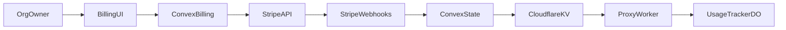

# Stripe Billing & Subscription System (Org-First)

## Overview

Integrate Stripe in an **org-first** model:

- One Stripe Customer per organization
- One Stripe Subscription per organization
- Per-seat billing via subscription item `quantity`
- Shared org usage limits with hard enforcement in proxy
- Manual addon packs plus optional auto-topup

Organizations are the billing boundary. Users are members of an org and can access org data according to app auth rules. Solo users still get a personal org with one seat.

## Locked Decisions

- **Billing authority is org-level.**
- **Per-seat billing** uses Stripe licensed pricing (`quantity = seat count`).
- **Hard limits only** at proxy (429 when blocked).
- **Overage model v1**: prepaid top-up packs + optional auto-topup with spend cap.
- **Seat policy**: Stripe Portal defaults (upgrades immediate, downgrades at period end).
- **Seat gate**: invite acceptance is blocked when org is at seat limit.
- **Monthly billing only** in v1.
- **No free trial** in v1.
- **Stripe Tax enabled from day one**.

## Billing Model

### Core Model

- Stripe Customer maps to organization, not individual user.
- Stripe Subscription maps to organization, not individual user.
- Seat count is subscription item quantity.
- Org limit each period:
  - `subscriptionUnits = includedUnitsPerSeat * seatQuantity`
  - `totalAvailableUnits = subscriptionUnits + addonUnits`
- Usage counters are org-level and reset on Stripe period rollover.

### Tiers

|                | Hobby (Free)  | Pro (Paid)                    |
| -------------- | ------------- | ----------------------------- |
| Price          | $0            | $TBD per seat per month       |
| Included units | `TBD` per org | `TBD` per seat                |
| Overage        | Hard blocked  | Top-up packs / auto-topup     |
| Addons         | Not allowed   | Allowed                       |
| Seats          | 1             | `quantity` on Stripe sub item |

### Addons and Auto-Topup (Pro)

Pro organizations can:

1. Buy manual addon packs via one-time Checkout.
2. Enable auto-topup when remaining units cross threshold.

Auto-topup guardrails:

- Monthly topup cap in cents (`overageCapCents`)
- Running spend (`currentPeriodOverageSpentCents`) resets each Stripe billing cycle
- If cap reached or payment fails, no credit is added; account blocks at exhaustion

## Seat Lifecycle

### Seat Increase

- Increase seats through Stripe Portal quantity update.
- Stripe applies proration per portal config (immediate update).
- System consumes `customer.subscription.updated` and syncs seat quantity.

### Seat Decrease

- Decrease seats via Stripe Portal.
- Downgrade is scheduled for period end by portal policy.
- System tracks pending downgrade and applies effective quantity at rollover.

### Seat Cap and Invites

- Invite acceptance checks `activeMembers < seatQuantity`.
- If at capacity, acceptance is blocked and user sees owner action required message.
- Owner must increase seats before invite can be accepted.

## Stripe-Aligned State Model

Stripe is source of truth for billing lifecycle. Internal state mirrors a simplified enforcement state:

| Internal State | Stripe Basis                                 | Proxy Behavior       |
| -------------- | -------------------------------------------- | -------------------- |
| `active`       | `active`, `trialing` (if enabled in future)  | Allow                |
| `grace`        | `past_due` during configured grace window    | Allow                |
| `suspended`    | unpaid after grace (or `unpaid` if used)     | 429 all org requests |
| `canceled`     | `canceled` / `customer.subscription.deleted` | 429 all org requests |

Notes:

- We keep custom `grace`/`suspended` transitions to enforce a 14-day grace policy.
- We do not rely on event order. Handlers fetch latest Stripe object when needed.

## Usage and Period Alignment

- Period boundaries come from Stripe subscription period.
- Durable Object rollover uses KV-provided `currentPeriodStart/currentPeriodEnd`.
- Calendar month `computePeriod()` is not used for billing enforcement.

Rollover actions:

1. Update period boundaries from Stripe renewal
2. Reset `currentPeriodOverageSpentCents`
3. Reset subscription usage counters
4. Keep addon balance (addons are prepaid credits, do not expire in v1)

## Architecture



### Upgrade / Subscribe Flow

1. Org owner starts Checkout
2. Checkout creates org customer (if missing) and org subscription
3. `checkout.session.completed` confirms success
4. `customer.subscription.updated` and `invoice.paid` finalize billing state
5. Convex syncs KV with status, seats, limits, and period boundaries

### Manual Addon Flow

1. Org owner starts addon Checkout
2. `payment_intent.succeeded` credits addon units idempotently
3. KV sync updates proxy limits

### Auto-Topup Flow

1. Usage tracker detects threshold crossing
2. Convex overage action acquires org-scoped lock
3. Action checks cap + current spend
4. Action creates charge (idempotency key scoped to org + period + sequence)
5. On success, credits addon units and increments period spend
6. KV sync publishes new capacity

## Webhooks and Idempotency

All webhook handlers must be idempotent and replay-safe.

### Required Events

- `checkout.session.completed`
- `customer.subscription.updated`
- `customer.subscription.deleted`
- `invoice.paid`
- `invoice.payment_failed`
- `payment_intent.succeeded` (addons/topup)

### Processing Rules

- Verify signature using raw body.
- Record `event.id` in `stripeEvents` ledger before side effects.
- If `event.id` already processed, return 2xx and skip.
- For out-of-order safety, fetch current Stripe object when mutating critical billing fields.
- Return 2xx quickly; move heavy work to async queue/scheduler.

## Proxy Enforcement

### Hard Limit Behavior

Request flow:

1. API key validation
2. Org billing status check
3. Usage check
4. Proxy or return 429

Block conditions:

- `suspended` / `canceled`
- `usage exceeded`

### 429 Payloads

Usage exceeded:

```json
{
  "error": "Usage limit exceeded",
  "code": "USAGE_LIMIT_EXCEEDED",
  "message": "Your organization has used all available units for this billing period. Increase seats, purchase addon units, or wait until reset.",
  "details": {
    "resetAt": "2025-02-01T00:00:00Z"
  }
}
```

Suspended:

```json
{
  "error": "Account suspended",
  "code": "ACCOUNT_SUSPENDED",
  "message": "Your organization is suspended due to billing issues. Update payment details in billing settings."
}
```

Canceled:

```json
{
  "error": "Account canceled",
  "code": "ACCOUNT_CANCELED",
  "message": "This organization subscription has been canceled. Contact support to reactivate."
}
```

## Dunning and Recovery

Default policy:

- Day 0: payment failure, status enters grace
- Day 14: unresolved grace transitions to suspended
- Day 90: canceled/purge policy per retention rules

Stripe Smart Retries should be enabled in dashboard. Internal scheduler enforces grace and suspension deadlines independently from webhook ordering.

## Stripe Tax

Enable Stripe Tax for subscription and addon checkout:

- `automatic_tax.enabled = true`
- `tax_id_collection.enabled = true` on Checkout
- For existing customers, set `customer_update.name=auto`
- Configure customer address update policy (`customer_update.address=auto` or shipping auto)

## Data Model (High Level)

### `subscriptions` (org-owned)

- `orgId`
- `tier`
- `status`
- `stripeCustomerId`
- `stripeSubscriptionId`
- `stripeSubscriptionItemId`
- `seatQuantity`
- `includedUnitsPerSeat`
- `monthlyUnits` (derived/cache)
- `addonUnits`
- `autoOverage`
- `overageCapCents`
- `currentPeriodOverageSpentCents`
- `currentPeriodStart`
- `currentPeriodEnd`

### `addonPurchases`

- `orgId`
- `triggeredByUserId` (optional for auto)
- `units`
- `amountCents`
- `stripePaymentIntentId`
- `mode` (`manual` | `auto`)
- `periodStart`

### `stripeEvents`

- `eventId` (unique)
- `eventType`
- `stripeObjectId`
- `processedAt`
- `status`
- `error` (optional)

### `organizationMembers` (new)

- `orgId`
- `userId`
- `role` (`owner` | `member`)
- `status` (`active` | `invited` | `removed`)

## Frontend Scope

- `/app/settings/billing` (org owner):
  - manage billing (portal)
  - seats and active member count
  - addon purchase
  - auto-topup + cap
- `/app/usage`:
  - billing status banner
  - usage remaining and reset time
  - actionable upgrade links

## Not in v1

- Annual billing
- Free trials
- Native Stripe metered billing
- Coupons/promo engine
- Multi-org membership switching UX beyond basic support
- Automated tax filing/remittance workflows

## References

- [Stripe subscription webhooks](https://docs.stripe.com/billing/subscriptions/webhooks)
- [Stripe webhook best practices](https://docs.stripe.com/webhooks)
- [Stripe process undelivered events](https://docs.stripe.com/webhooks/process-undelivered-events)
- [Stripe per-seat pricing](https://docs.stripe.com/subscriptions/pricing-models/per-seat-pricing)
- [Stripe quantities](https://docs.stripe.com/billing/subscriptions/quantities)
- [Stripe prorations](https://docs.stripe.com/billing/subscriptions/prorations)
- [Stripe customer portal](https://docs.stripe.com/customer-management/integrate-customer-portal)
- [Stripe portal configuration](https://docs.stripe.com/customer-management/configure-portal)
- [Stripe Tax checkout](https://docs.stripe.com/tax/checkout)
