# Stripe Billing & Subscription System (Org-First)

## Overview

Integrate Stripe in an **org-first** model:

- One Stripe Customer per organization
- One Stripe Subscription per organization
- Per-seat billing via subscription item `quantity`
- Shared org usage limits with soft enforcement in proxy (always proxy, conditionally record)
- Manual addon packs plus optional auto-topup

Organizations are the billing boundary. Users are members of an org and can access org data according to app auth rules. Solo users still get a personal org with one seat.

## Locked Decisions

- **Billing authority is org-level.**
- **Per-seat billing** uses Stripe licensed pricing (`quantity = seat count`).
- **Soft limits** — proxy always forwards to LLM provider, record traces conditionally based on billing/usage status.
- **Overage model v1**: prepaid top-up packs + optional auto-topup with spend cap.
- **Seat policy**: seat updates via `updateSeatQuantity` action (validates against active member count). Stripe Portal used for billing management only.
- **Seat gate**: invite acceptance is blocked when org is at seat limit.
- **Monthly billing only** in v1.
- **No free trial** in v1.
- **Stripe Tax enabled from day one**.

## Billing Model

### Core Model

- Stripe Customer maps to organization, not individual user.
- Stripe Subscription maps to organization, not individual user.
- Subscription has two line items: base plan (`stripePlanItemId`) and per-seat (`stripeSeatItemId`).
- Seat count is the per-seat subscription item quantity.
- Org limit each period:
  - `monthlyUnits` is tier-based (hobby: 50k, pro: 100k) -- flat per org, not per seat.
  - `totalAvailableUnits = monthlyUnits + addonUnits`
- Usage counters are org-level and reset on Stripe period rollover.

### Tiers

|                | Hobby (Free)   | Pro (Paid)                    |
| -------------- | -------------- | ----------------------------- |
| Price          | $0             | $TBD per seat per month       |
| Included units | 50,000 per org | 100,000 per org               |
| Overage        | Hard blocked   | Top-up packs / auto-topup     |
| Addons         | Not allowed    | Allowed ($8 per 100k units)   |
| Seats          | 1              | `quantity` on Stripe sub item |
| Retention      | 7 days         | 30 days                       |

Config is defined in `@trace-flow/types` as `TIER_CONFIG` and `RETENTION_DAYS`.

### Addons and Auto-Topup (Pro)

Pro organizations can:

1. Buy manual addon packs via one-time Checkout (`createAddonCheckoutSession`). Takes `quantity` (number of 100k-unit packs); units are derived server-side as `quantity * UNITS_PER_ADDON`.
2. Enable auto-topup when remaining units cross 90% threshold (`checkAutoTopup` in `usage.ts`).

Auto-topup guardrails:

- Monthly topup cap in cents (`overageCapCents`)
- Running spend (`currentPeriodOverageSpentCents`) resets each Stripe billing cycle
- Atomic spend reservation via `reserveAutoTopup` mutation before charging Stripe
- If reservation fails (cap reached, not pro, disabled), topup is skipped
- If Stripe charge fails, reservation is released via `releaseAutoTopupReservation`
- 15-minute dedup window (`autoTopupPendingSince`) prevents concurrent topups
- Idempotency key scoped to org + period + purchase count

### Refund Handling

`charge.refunded` webhook revokes addon units by matching `stripePaymentIntentId` to `addonPurchases` records and subtracting credited units from the subscription.

## Seat Lifecycle

### Seat Increase

- Owner calls `updateSeatQuantity` action.
- Action validates `seatQuantity >= activeMembers` before updating Stripe.
- Stripe applies proration per subscription config.
- `customer.subscription.updated` webhook syncs the new quantity.

### Seat Decrease

- Owner calls `updateSeatQuantity` with lower count.
- Action validates `seatQuantity >= activeMembers` (cannot reduce below active count).
- Stripe subscription is updated immediately; proration behavior depends on Stripe config.

### Seat Cap and Invites

- Invite acceptance checks `activeMembers < seatQuantity` in `acceptInvite` handler.
- If at capacity, acceptance is blocked and user sees "seat limit reached" error.
- Owner must increase seats before invite can be accepted.
- `canAddMember` internal query also available for programmatic seat checks.

## Stripe-Aligned State Model

Stripe is source of truth for billing lifecycle. Internal state mirrors a simplified enforcement state:

| Internal State | Stripe Basis                                 | Proxy Behavior        |
| -------------- | -------------------------------------------- | --------------------- |
| `active`       | `active`, `trialing` (if enabled in future)  | Proxy + record traces |
| `grace`        | `past_due` during configured grace window    | Proxy + record traces |
| `suspended`    | unpaid after grace (or `unpaid` if used)     | Proxy, no recording   |
| `canceled`     | `canceled` / `customer.subscription.deleted` | Proxy, no recording   |

Notes:

- We keep custom `grace`/`suspended` transitions to enforce a 14-day grace policy via Convex scheduler.
- `upsertStripeSubscriptionState` cancels pending grace schedulers when transitioning to `active`.
- We do not rely on event order. Handlers fetch latest Stripe object when needed (e.g., `checkout.session.completed` retrieves the full subscription).

## Usage and Period Alignment

- Period boundaries come from Stripe subscription period.
- Durable Object `UsageTracker` receives `SubscriptionKVData` on each request and detects period changes.
- DO handles rollover autonomously: resets subscription counters, snapshots addon baseline, rolls period forward if Stripe sync lags.

Rollover actions:

1. Push final usage totals to Convex before reset
2. Update period boundaries (from KV or forward-roll if Stripe lags)
3. Reset subscription usage counters to 0
4. Snapshot addon_units_used as baseline (addon usage does NOT reset)
5. `upsertStripeSubscriptionState` resets `currentPeriodOverageSpentCents` when period start changes

## Architecture

```mermaid
flowchart LR
OrgOwner --> BillingUI
BillingUI --> ConvexBilling
ConvexBilling --> StripeAPI
StripeAPI --> StripeWebhooks
StripeWebhooks --> ConvexState
ConvexState --> CloudflareKV
CloudflareKV --> ProxyWorker
ProxyWorker --> UsageTrackerDO
UsageTrackerDO -->|alarm every 60s| ConvexUsageRecord["/usage/record"]
ConvexUsageRecord --> AutoTopup["checkAutoTopup"]
```



### Upgrade / Subscribe Flow

1. Org owner calls `createOrgCheckoutSession` action
2. Action creates Stripe Customer if missing, persists ID to both `organizations` and `subscriptions` tables
3. Creates Checkout Session with plan + seat line items
4. `checkout.session.completed` retrieves full subscription from Stripe, calls `upsertStripeSubscriptionState`
5. `customer.subscription.created`/`updated` further sync state
6. `invoice.paid` confirms active status and updates period boundaries
7. `scheduleKVSync` pushes subscription data to Cloudflare KV as `sub:{orgId}`

### Downgrade / Cancellation Flow

1. Customer cancels via Stripe Portal or subscription is deleted
2. `customer.subscription.deleted` webhook triggers `revertToHobby`:
   - Cancels any pending grace period scheduler
   - Resets to hobby tier with 50k units, 0 addons, 0 overage
   - Clears all Stripe IDs (subscription, plan item, seat item)
   - Sets fresh 30-day period
   - Syncs to KV
3. `customer.subscription.updated` with `cancel_at_period_end: true` stores the pending cancellation for UI display

### Manual Addon Flow

1. Org owner calls `createAddonCheckoutSession` with `quantity` (number of packs)
2. Units derived server-side: `quantity * UNITS_PER_ADDON` (100k per pack)
3. Creates Checkout Session in `payment` mode with invoice creation enabled
4. Invoice metadata includes `orgId`, `ownerUserId`, `addonUnits`, `mode: 'manual'`
5. `invoice.paid` webhook reads metadata, validates units are a positive multiple of `UNITS_PER_ADDON`
6. Extracts `paymentIntentId` from invoice payments (Stripe v20+ API)
7. Calls `creditAddonPurchase` which is idempotent (dedupes on `stripePaymentIntentId`)
8. KV sync updates proxy limits

### Auto-Topup Flow

1. `UsageTracker` DO pushes usage totals to `/usage/record` endpoint every 60 seconds
2. `/usage/record` calls `checkAutoTopup` mutation after recording usage
3. If usage ratio >= 90% and auto-topup enabled: schedules `triggerAutoTopup` action
4. Action calls `reserveAutoTopup` (atomic cap check + spend reservation)
5. Creates Stripe invoice item + invoice, pays it
6. On success: calls `creditAddonPurchase` with units and payment intent ID
7. On failure: calls `releaseAutoTopupReservation` to restore cap headroom

## Webhooks and Idempotency

All webhook handlers must be idempotent and replay-safe.

### Handled Events

- `checkout.session.completed` -- initial subscription setup
- `customer.subscription.created` -- subscription state sync (not in original spec, added for robustness)
- `customer.subscription.updated` -- seat changes, status changes, period updates, `cancelAtPeriodEnd`
- `customer.subscription.deleted` -- revert to hobby
- `invoice.paid` -- addon credit (via metadata) or subscription renewal confirmation
- `invoice.payment_failed` -- transition to grace + schedule suspension
- `charge.refunded` -- revoke addon units (not in original spec, added for refund handling)

### Processing Rules

- Verify signature using raw body via `stripe.webhooks.constructEvent`.
- Record `event.id` in `stripeEvents` ledger via `startProcessing` before side effects.
- If `event.id` already processed (status `processed`), return 2xx and skip.
- Stuck events (status `processing` for > 5 minutes) are eligible for reprocessing.
- Failed events can be retried.
- For out-of-order safety, `checkout.session.completed` fetches the full subscription from Stripe.
- `invoice.paid` for subscription renewals fetches the subscription for period boundaries.
- On processing error: mark event `failed` with error message, return 500 so Stripe retries.

## Proxy Enforcement

### Soft Enforcement

The proxy never blocks LLM requests due to billing or usage. It always forwards to the provider and conditionally records traces based on a `TracingDecision`.

Request flow:

1. API key validation (`validateApiKey` -- checks KV for key existence and expiry) → **hard 401** on failure
2. Org ID check → **hard 403** if API key has no org
3. Billing status check (`checkBillingStatus` -- reads `sub:{orgId}` from KV) → returns status object
4. Usage check via Durable Object (`checkUsage` -- reuses subscription data from step 3) → skipped when billing is suspended/canceled/not_found/error
5. `resolveTracingDecision(billing, usage)` → `{ record: boolean, reason, tier?, periodEnd? }`
6. **Always proxy** request to LLM provider
7. `waitUntil`: if `decision.record` → capture streams, store to R2, enqueue; else → cancel capture stream
8. Set response headers

### Response Headers

All proxied responses include:

- `X-Trace-Flow-Recording: true|false`
- `X-Trace-Flow-Recording-Reason: <reason>` (only when `false`)
- `X-Trace-Flow-Period-Reset: <ISO date>` (only when reason is `exceeded`)

Reasons: `ok`, `exceeded`, `suspended`, `canceled`, `no_subscription`, `internal_error`

### OTLP Endpoint (`/v1/traces`)

No upstream to proxy — OTLP is direct trace ingestion. Billing and usage checks return standard OTLP `partialSuccess` with `rejectedSpans` when traces cannot be recorded. The `X-Trace-Flow-Recording` header is set on all responses.

## Dunning and Recovery

Implemented policy:

- Day 0: `invoice.payment_failed` transitions status to `grace` and schedules suspension
- Day 14: `transitionGraceToSuspended` scheduler fires, moves status to `suspended`
- If payment succeeds during grace: `upsertStripeSubscriptionState` with `active` cancels the grace scheduler

Not yet implemented:

- Day 90 canceled/purge policy per retention rules
- Billing failure notification emails to org owner

Stripe Smart Retries should be enabled in dashboard. Internal scheduler enforces grace and suspension deadlines independently from webhook ordering.

## Stripe Tax

Enabled on both subscription and addon checkout sessions:

- `automatic_tax: { enabled: true }`
- `tax_id_collection: { enabled: true }` on subscription Checkout
- `customer_update: { name: 'auto', address: 'auto' }` on subscription Checkout

## Data Model

### `subscriptions` (org-owned)

- `orgId` (ref: organizations)
- `tier` (`'hobby'` | `'pro'`)
- `status` (`'active'` | `'grace'` | `'suspended'` | `'canceled'`)
- `monthlyUnits` (number)
- `addonUnits` (number)
- `seatQuantity` (number)
- `currentPeriodStart` (number, epoch ms)
- `currentPeriodEnd` (number, epoch ms)
- `currentPeriodOverageSpentCents` (number)
- `addonPurchaseCount` (number)
- `stripeCustomerId` (optional string)
- `stripeSubscriptionId` (optional string)
- `stripePlanItemId` (optional string)
- `stripeSeatItemId` (optional string)
- `cancelAtPeriodEnd` (optional boolean)
- `autoOverage` (optional boolean)
- `overageCapCents` (optional number)
- `gracePeriodSchedulerId` (optional, ref: \_scheduled_functions)
- `autoTopupPendingSince` (optional number, epoch ms)

Indexes: `by_org_id`, `by_stripe_subscription_id`, `by_stripe_customer_id`

### `addonPurchases`

- `orgId` (ref: organizations)
- `triggeredByUserId` (optional, ref: users)
- `units` (number)
- `amountCents` (number)
- `stripePaymentIntentId` (string)
- `stripeInvoiceId` (optional string)
- `mode` (`'manual'` | `'auto'`)
- `periodStart` (number)

Indexes: `by_org_id`, `by_payment_intent`

### `stripeEvents`

- `eventId` (string, unique via index)
- `eventType` (string)
- `stripeObjectId` (optional string)
- `status` (`'processing'` | `'processed'` | `'failed'`)
- `processedAt` (optional number)
- `error` (optional string)

Indexes: `by_event_id`, `by_status`

### `organizationMembers`

- `orgId` (ref: organizations)
- `userId` (ref: users)
- `role` (`'owner'` | `'member'`)
- `status` (`'active'` | `'invited'` | `'removed'`)
- `invitedAt` (optional number)
- `joinedAt` (optional number)
- `removedAt` (optional number)

Indexes: `by_org_id`, `by_user_id`, `by_org_id_status`

### `usage`

- `orgId` (ref: organizations)
- `periodStart` (number)
- `periodEnd` (number)
- `subscriptionUnitsUsed` (number)
- `addonUnitsUsed` (number)

Index: `by_org_id_period` (`orgId`, `periodStart`)

### KV State (`sub:{orgId}`)

Synced from Convex via `cloudflare.syncSubscriptionToKV`. Contains `SubscriptionKVData`:

```typescript
{
  (tier,
    monthlyUnits,
    addonUnits,
    status,
    seatQuantity,
    currentPeriodStart,
    currentPeriodEnd,
    autoOverage,
    overageCapCents,
    cancelAtPeriodEnd);
}
```

## Frontend Scope

### `/app/settings/billing` (org owner)

Implemented in `Billing.tsx`:

- Subscription status and tier display
- Cancel-at-period-end banner with end date
- Seat quantity update (validates >= 1)
- Manage billing (Stripe Portal redirect)
- Start / upgrade subscription (Checkout redirect)
- Buy addon packs (quantity input, Checkout redirect)
- Auto-topup toggle with spend cap configuration
- Reconcile billing state (force Stripe sync)

### `/app/usage`

Implemented in `Usage.tsx` (via `usage/Usage.tsx`):

- Billing status banner with seat count, included units, reset date
- Usage progress bar with color thresholds (green/amber/red at 70%/90%)
- Link to billing settings
- Cost analytics: timeseries, provider/model/operation/API key breakdowns
- Projected cost forecast

## Production Gaps

### Must Have

1. **Billing notification emails**: No emails sent on payment failure, grace entry, suspension, or successful charge. Org owners have no visibility into billing issues outside the dashboard.
2. **Day 90 cancellation policy**: Spec mentions Day 90 canceled/purge but `revertToHobby` only fires on `customer.subscription.deleted`. No scheduler exists to auto-cancel suspended orgs after extended non-payment.
3. **Stripe Portal configuration**: Code uses Portal for billing management but no Portal configuration is documented or verified (allowed actions, branding, etc.). Seat changes via Portal are not validated against active member count server-side.
4. **`includedUnitsPerSeat` removal**: Spec references `includedUnitsPerSeat` but implementation uses flat `monthlyUnits` per tier. Units are not multiplied by seat count. Spec and code are now aligned but the original per-seat unit scaling design was dropped without explicit documentation.
5. **Hobby seat enforcement**: Spec says hobby has 1 seat, but nothing in the code prevents a hobby org from having `seatQuantity > 1` if set before downgrade. `revertToHobby` does not reset `seatQuantity` to 1.

### Should Have

6. **Usage approaching limit notifications**: No in-app or email notification when usage approaches the limit (e.g., 80%, 90%). Auto-topup only triggers at 90% for pro orgs with it enabled.
7. **Addon purchase history UI**: `addonPurchases` table is populated but no UI exists to show purchase history to the org owner.
8. **Failed webhook visibility**: `stripeEvents` tracks failed events but no admin UI or alerting exists to surface persistent failures.
9. **Reconciliation scheduling**: Manual reconcile exists but no automatic periodic reconciliation to catch drift between Stripe and local state.
10. **Subscription creation flow**: When a new org is created, there's no documented flow for bootstrapping a hobby subscription record. The initial subscription row must exist for seat gating and usage tracking to work.

### Nice to Have

11. **Invoice download/history**: No link to Stripe-hosted invoices from the billing UI.
12. **Multiple payment methods**: Portal handles this but no in-app display of payment method status.
13. **Tax receipt/exemption management**: Tax is collected but no UI for managing tax IDs or exemptions beyond what Stripe Portal provides.
14. **Usage export**: No ability to export usage data for accounting/reconciliation.

## Not in v1

- Annual billing
- Free trials
- Native Stripe metered billing
- Coupons/promo engine
- Multi-org membership switching UX beyond basic support
- Automated tax filing/remittance workflows

## References

- [Stripe subscription webhooks](https://docs.stripe.com/billing/subscriptions/webhooks)
- [Stripe webhook best practices](https://docs.stripe.com/webhooks)
- [Stripe process undelivered events](https://docs.stripe.com/webhooks/process-undelivered-events)
- [Stripe per-seat pricing](https://docs.stripe.com/subscriptions/pricing-models/per-seat-pricing)
- [Stripe quantities](https://docs.stripe.com/billing/subscriptions/quantities)
- [Stripe prorations](https://docs.stripe.com/billing/subscriptions/prorations)
- [Stripe customer portal](https://docs.stripe.com/customer-management/integrate-customer-portal)
- [Stripe portal configuration](https://docs.stripe.com/customer-management/configure-portal)
- [Stripe Tax checkout](https://docs.stripe.com/tax/checkout)
